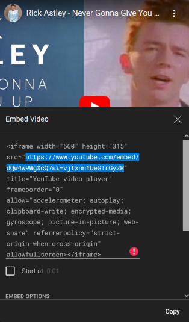

# ajc-portfolio

## Made for ****** ****

---

## Created by

Zach Dodson

* [GitHub](https://github.com/zdodson21)
* [Linkedin](https://www.linkedin.com/in/zach-dodson-psu/)

---

### How stuff works

* `<picture-frame>` & `picture-frame.js`
  * When implementing `<picture-frame>`, you must specify the `display-location` attribute as any of the following options:
    * `left` or `l`
    * `right` or `r`
    * `top` or `t`
  * Also when implementing `picture-frame`, you must specify the `type` attribute for one of the three attribute types you wish to use:
    * `image` for an image file
    * `video` for a local video file
    * `youtube` for a youtube link
      * Important note about youtube links: You **MUST** use the link provided when you click 'share', then click 'embed'. Copy and paste the link shown here into the `src` attribute: 
    * `pdf` for a pdf file *NOT YET IMPLEMENTED*
  * Attributes:
    * `display-location`
      * **Type**: String
      * **Description**: Where you want your piece of media to appear, the left side, right side, or top of the frame.
      * **Applicable Values**:
        * `left` or `(l)` - Media displays on the left, text description on the right
        * `right` or `(r)` - Media displays on the right, text description on the left
        * `top` or `(t)` - Media displays on the Top, text description on the bottom
    * `src`
      * **Type**: String
      * **Description**: The source location of the piece of media you wish to display. Can be a local directory or a link (depending on the `type`).
    * `alt`
      * **Type**: String
      * **Description**: Alternative text in case image does not load, or no `src` attribute is defined when `type="image`. Also important for accessibility.
    * `caption`
      * **Type**: String
      * **Description**: Text description of piece of media.
    * `href`
      * **Type**: String
      * **Description**: The location you wish for a link to go to.
    * `anchor-text`
      * **Type**: String
      * **Description**: The text displayed instead of the link text. If left blank, link text will display instead.
    * `type`
      * **Type**: Boolean
      * **Description**: Type of media being presented
      * **Applicable Values**:
        * `image` - local directory image file or image link
        * `video` - local directory video file
        * `youtube` - YouTube link from Embed code (instructions above)
        * `pdf` - PDF File. Will also generate clickable text to preview PDF in new tab, or download the file onto the user's device. *NOT YET IMPLEMENTED*
    * `border`
      * **Type**: Boolean
      * **Description**: Displays a border around the whole element
      * **Applicable Values**:
        * `true` (default) - Border is shown
        * `false` - Border is not shown

---
